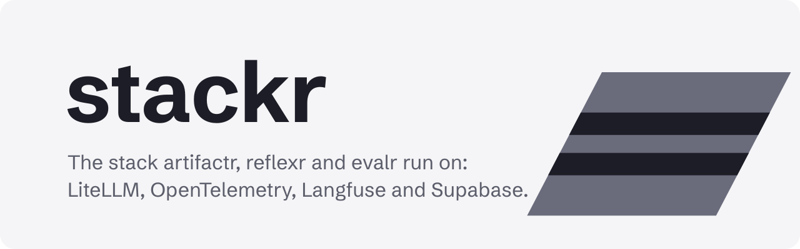

<picture>
  <source media="(prefers-color-scheme: dark)" srcset="docs/assets/brand/banner-dark.svg">
  
</picture>

<p>
  <a href="https://stackr.alexnodeland.com"></a>
  <a href="https://github.com/alexnodeland/stackr/actions/workflows/ci.yml"></a>
  
  
  
  <a href="LICENSE"></a>
</p>

**stackr** is the infrastructure template for applications built on [artifactr](https://github.com/alexnodeland/artifactr), [reflexr](https://github.com/alexnodeland/reflexr) and [evalr](https://github.com/alexnodeland/evalr): local Supabase, the LiteLLM gateway, OpenTelemetry, Grafana's LGTM stack with Pyroscope, and Langfuse, as one Docker Compose project with profiles, and a [Copier](https://copier.readthedocs.io) template that generates an application already wired to all of them.

> **Status:** pre-release. v0.1 is built, as planned in [RFC-0001](docs/rfcs/0001-v0.1-implementation-plan.md), and not yet released.

## Why

Every application on the libraries needs the same infrastructure: a database with sign-in, a gateway in front of the models with budgets and guardrails, traces, metrics, logs and profiles, and a place for LLM traces, scores and datasets. The libraries emit OpenTelemetry, reach models through a LiteLLM proxy and ship their own Grafana dashboards, and stackr is where those pieces are configured to meet. Applications talk only to ports (OTLP, the OpenAI API, a PostgreSQL URL, JWTs, Langfuse's API), so moving one from the local stack to hosted services changes its settings, not its code.

## Quick start

You need Docker with Compose v2, [uv](https://docs.astral.sh/uv/), `make`, and the [Supabase CLI](https://supabase.com/docs/guides/local-development/cli/getting-started) (or Node, to run it through `npx`).

```bash
git clone https://github.com/alexnodeland/stackr.git
cd stackr
make env        # .env, with local secrets generated
make up         # start the stack, with local Supabase
make smoke      # send test telemetry through it and check it arrives
make down       # stop it, keeping its data
```

| Service | Address | Sign in with (from `.env`) |
|---|---|---|
| Grafana | <http://localhost:3000> | `admin`, `GRAFANA_ADMIN_PASSWORD` |
| Langfuse | <http://localhost:3300> | `LANGFUSE_ADMIN_EMAIL`, `LANGFUSE_ADMIN_PASSWORD` |
| Supabase Studio | <http://localhost:54323> | |
| LiteLLM admin UI | <http://localhost:4400/ui> | `admin`, `LITELLM_MASTER_KEY` |

Applications send OTLP to `localhost:4317` (gRPC) or `localhost:4318` (HTTP), and reach models through the gateway at `http://localhost:4400` with a tenant's key: `make tenant NAME=acme` creates one. Provider keys go in `.env`. Run `make` to list every command.

## Start an application

```bash
uvx copier copy gh:alexnodeland/stackr my-app
cd my-app
git init            # the git hooks and `copier update` need a repository
make install        # writes uv.lock: commit it
make env && make check
make up             # runs it beside the stack, at http://localhost:8800
```

It generates an application on artifactr, reflexr or both: FastAPI with each library's REST, WebSocket and MCP surfaces, Supabase sign-in and PostgreSQL, agents on the gateway, OpenTelemetry, feedback as Langfuse scores, evalr experiments, and the family's quality gates. `uvx copier update` brings in the template's later improvements.

## What you get

- **Profiles as adapter sets.** `observability`, `langfuse` and `gateway`, started together or one at a time, with local Supabase or plain PostgreSQL as the database behind one setting.
- **An LLM gateway.** Model groups with fallbacks across providers, a team and a budget per tenant, and guardrails chosen per request.
- **One route for telemetry.** The Collector sends traces to Tempo and Langfuse, metrics to Prometheus and logs to Loki, and Grafana links them to each other and to Pyroscope's profiles, with the libraries' dashboards pinned by release.
- **Checked every way it can be.** `make validate` checks every configuration with each service's own validator, and the smoke tests start the stack and follow telemetry, a gateway request and an application's agents to where they land, on every pull request.
- **Local by default.** Secrets generated into a gitignored `.env`, and every published port bound to `127.0.0.1`.

## Documentation

The documentation site is at **<https://stackr.alexnodeland.com>**. It is built from [`docs/`](docs/index.md) and published from `main` on every push; run `make docs-serve` to read it locally at <http://localhost:8000>.

- [Getting started](docs/getting-started.md) and the [guides](docs/guides/stack.md): the stack and its profiles, local Supabase, the LLM gateway, observability, Langfuse, the application template, the smoke tests, validation and CI, security and troubleshooting.
- [Reference](docs/reference/index.md): every service, setting, pipeline, data source, model, template question, command and pinned version, generated from the files that define them.
- [Architecture](docs/architecture.md): the ports, the profiles and what exists today.
- [Architecture decision records](docs/adr/README.md): why each part is the way it is.
- [RFCs](docs/rfcs/README.md): proposals and the v0.1 build plan.
- [Brand](docs/assets/brand/README.md): the mark, colours and type.

## The family

stackr is the infrastructure of a family with [artifactr](https://github.com/alexnodeland/artifactr), for chats in which people and agents edit shared artifacts; [reflexr](https://github.com/alexnodeland/reflexr), for workflows that events start; and [evalr](https://github.com/alexnodeland/evalr), which evaluates both against people's feedback. The libraries' dev containers join its network, and its template generates applications on them.

## Contributing

See [CONTRIBUTING.md](CONTRIBUTING.md) for setup, the trunk-based workflow, and the RFC and ADR process.

## License

[MIT](LICENSE)
