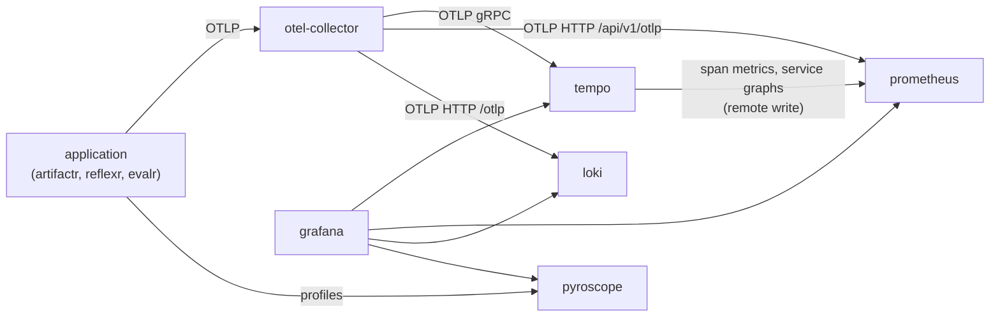

# Architecture

> **Status:** accepted design, being built in the phases tracked by [RFC-0001](rfcs/0001-v0.1-implementation-plan.md). This document is evergreen: it is updated in the same pull request as the change it describes, and the table below shows what exists today. Decisions are recorded in [`adr/`](adr/README.md), and proposals in [`rfcs/`](rfcs/README.md).

| Part | Status |
|---|---|
| Foundation: layout, `make`, generated secrets, static validation in CI | Implemented |
| `observability` profile: OpenTelemetry Collector, Prometheus, Tempo, Loki, Pyroscope, Grafana | Implemented |
| `langfuse` profile: Langfuse web and worker, ClickHouse, Redis, MinIO | Planned (phase 2) |
| Local Supabase, through its CLI | Planned (phase 3) |
| `gateway` profile: the LiteLLM proxy | Planned (phase 4) |
| The application template (Copier) and the `app` profile | Planned (phase 5) |
| Documentation site | Planned (phase 6) |

## What stackr is

stackr is the **infrastructure template** for applications built on [artifactr](https://github.com/alexnodeland/artifactr), [reflexr](https://github.com/alexnodeland/reflexr) and evalr. It has two parts:

- **The stack:** the services those applications run on (a database platform, an LLM gateway, telemetry and LLM observability), as one Docker Compose project with profiles, beside local Supabase.
- **The application template:** a Copier template that scaffolds an application already wired to the stack.

The libraries emit OpenTelemetry through its API only, reach models through the LiteLLM proxy, and ship their own Grafana dashboards. stackr is where those pieces are configured to meet.

## Ports and adapters

Applications talk only to **ports**: a stable protocol at a stable address, configured by a few settings. Behind each port is an **adapter**, the service that implements it, and swapping an adapter changes stackr's configuration, never an application's ([ADR-0005](adr/0005-ports-and-adapters-for-the-stack.md)). Compose profiles are adapter sets.

| Port | Contract | Settings an application reads | Default adapter | Status |
|---|---|---|---|---|
| Telemetry | OTLP to the Collector: gRPC 4317, HTTP 4318 | `OTEL_EXPORTER_OTLP_ENDPOINT`, `OTEL_EXPORTER_OTLP_PROTOCOL`, `OTEL_SERVICE_NAME`, `OTEL_RESOURCE_ATTRIBUTES` | The Collector, exporting to Tempo, Prometheus, Loki and Langfuse | Implemented; Langfuse planned (phase 2) |
| Profiles | Pyroscope's push API | `PYROSCOPE_SERVER_ADDRESS` | Pyroscope | Implemented |
| LLM gateway | OpenAI-compatible HTTP API, with models named by alias or group | `LITELLM_BASE_URL`, `LITELLM_API_KEY`; `OPENAI_BASE_URL`, `OPENAI_API_KEY` for OpenAI SDKs | The LiteLLM proxy | Planned (phase 4) |
| Database | A PostgreSQL connection string | `DATABASE_URL` | Local Supabase's PostgreSQL; plain PostgreSQL as the alternative | Planned (phase 3) |
| Object storage | The S3 API | `S3_ENDPOINT_URL`, `S3_REGION`, `S3_BUCKET`, `S3_ACCESS_KEY_ID`, `S3_SECRET_ACCESS_KEY`, `S3_FORCE_PATH_STYLE` | MinIO | Planned (phase 2) |
| Identity | JWTs, verified against the issuer's key set | `AUTH_ISSUER`, `AUTH_JWKS_URL`, `AUTH_AUDIENCE` | Supabase Auth | Planned (phase 5) |
| Evaluation data | Langfuse's public API, for scores and datasets | `LANGFUSE_BASE_URL`, `LANGFUSE_PUBLIC_KEY`, `LANGFUSE_SECRET_KEY` | Self-hosted Langfuse | Planned (phase 2) |

The settings are a contract with the libraries' extras and the application template, which generates applications wired to these ports only. Profiles and evaluation data are the two narrow ports: profiles go to Pyroscope directly until OTLP profiles are stable in the Collector, and Langfuse's API carries scores and datasets, never traces.

## Layout

```
compose.yaml        the stack: one Compose project, with profiles
.env.example        settings and placeholders; `make env` turns it into .env
versions.env        versions pinned outside compose.yaml: the libraries' dashboards
deploy/<service>/   each service's configuration, mounted read-only
scripts/            setup-env, validate, smoke and fetch-dashboards, run by make and CI
docs/               this document, ADRs and RFCs
```

The Supabase CLI project will live in `supabase/` (phase 3).

## Conventions

- **One Compose project, named `stackr`,** with profiles, so only what a task needs runs ([ADR-0001](adr/0001-compose-first-with-profiles.md)).
- **A fixed network name, `stackr`.** The libraries' dev containers and applications join it as an external network and reach every service by name, such as `otel-collector:4317` ([ADR-0006](adr/0006-networks-and-published-ports.md)).
- **Published ports bind to `STACKR_BIND`,** `127.0.0.1` by default, so the stack is reachable from this machine only. Each port is a setting in `.env`.
- **Images are pinned** to versions, and Dependabot proposes updates.
- **Secrets are generated** into a gitignored `.env` by `scripts/setup-env`. `.env.example` holds only settings and placeholders. Compose fails when a required value is missing, rather than starting a service with an empty secret.

## The observability profile

| Service | Image | Role | Published port |
|---|---|---|---|
| `otel-collector` | `otel/opentelemetry-collector-contrib` | The telemetry port: receives OTLP, exports each signal to its backend | 4317 (gRPC), 4318 (HTTP) |
| `tempo` | `grafana/tempo` | Traces, with its metrics generator for span metrics and service graphs | 3200 |
| `prometheus` | `prom/prometheus` | Metrics: OTLP from the Collector, remote write from Tempo, and scrapes of the stack's own services | 9090 |
| `loki` | `grafana/loki` | Logs, over OTLP | 3100 |
| `pyroscope` | `grafana/pyroscope` | Profiles, pushed by applications | 4040 |
| `grafana` | `grafana/grafana` | Dashboards and exploration; signs in as `admin` with `GRAFANA_ADMIN_PASSWORD` from `.env` | 3000 |

The image versions are pinned in `compose.yaml`.

### The telemetry path



How each signal is routed, and why metrics use Prometheus's OTLP receiver, is in [ADR-0007](adr/0007-how-telemetry-reaches-the-backends.md). The Collector's configuration is `deploy/otel-collector/config.yaml`; replacing a backend means replacing its exporter there.

### Metric names in Prometheus

Prometheus translates OTLP metrics with its default strategy. The libraries' dashboards query the translated names:

| OTLP metric (unit) | Kind | In Prometheus |
|---|---|---|
| `artifactr.commands` (`1`) | Counter | `artifactr_commands_total` |
| `artifactr.commit.duration` (`s`) | Histogram | `artifactr_commit_duration_seconds_bucket`, `_sum`, `_count` |
| `artifactr.stream.connections` (`{connection}`) | Up-down counter | `artifactr_stream_connections` |

- `service.name` becomes the `job` label. `deployment.environment.name` and `service.version` are copied from the resource onto every series (as `deployment_environment_name` and `service_version`); other resource attributes are on `target_info`.
- Data point attributes become labels with dots turned into underscores: `artifactr.command.type` becomes `artifactr_command_type`.
- Tempo's metrics generator adds `traces_spanmetrics_calls_total`, `traces_spanmetrics_latency_bucket` and `traces_service_graph_request_total`, labelled by `service`, `span_name`, `span_kind` and `status_code`.

### Grafana

- **Data sources** are provisioned with fixed uids, which dashboards refer to: `prometheus`, `tempo`, `loki` and `pyroscope`.
- **Links between signals:** a span links to its service's logs around the span's time, filtered to the trace (Loki); to its service's span metrics (Prometheus); and to its service's CPU profile (Pyroscope). Log lines with a `trace_id` link to the trace, and histogram exemplars link to the trace that produced them. Tempo's service map and node graph read the service graph metrics.
- **Dashboards** are files under `deploy/grafana/dashboards/`, one folder per directory:
  - `stackr/` is committed. **Collector health** (`stackr-collector`) shows what the Collector receives, what each backend receives, send failures, queues, memory and CPU, and whether each of the stack's services is up.
  - `artifactr/` and `reflexr/` are the libraries' own dashboards, downloaded by `make dashboards` (and `make up`) at the release pinned in `versions.env`, and gitignored.

### The libraries' dashboards

Each library publishes its dashboards with every release, as one archive of dashboard JSON files at

```
https://github.com/alexnodeland/<library>/releases/download/v<version>/<library>-dashboards-<version>.tar.gz
```

`versions.env` pins the release for each library (`ARTIFACTR_DASHBOARDS_VERSION`, `REFLEXR_DASHBOARDS_VERSION`), with an optional sha256 of the archive. `scripts/fetch-dashboards` downloads each pinned archive, checks its sha256, and replaces the library's folder. A library with no version pinned is skipped, and a failed download is a warning (an error with `--strict`), so `make up` works offline and before a library has published. To move to a new release, change its version and sha256 in `versions.env`, then run `make dashboards` and `make smoke`.

## Commands

| Command | What it does |
|---|---|
| `make env` | Create or update `.env`, generating local secrets; re-running keeps existing values |
| `make up` | Start the stack, or the profiles named in `PROFILES` (`make up PROFILES=observability`) |
| `make down` / `make reset` | Stop the stack, keeping or deleting its data volumes |
| `make dashboards` | Download the libraries' dashboards at the releases pinned in `versions.env` |
| `make validate` | Check every configuration without starting containers |
| `make smoke` | Send test telemetry through the running stack and check it arrives |

## Validation

CI checks the stack two ways on every pull request, with the same scripts as `make validate` and `make smoke`.

**Statically,** without starting the stack:

- every YAML file with yamllint
- the Compose configuration for each profile on its own and for all of them together, failing on warnings
- each service's configuration with that service's own validator, run from the image `compose.yaml` pins: `otelcol-contrib validate` for the Collector, `promtool check config` for Prometheus, `-config.verify` for Tempo and `-verify-config` for Loki
- the Grafana dashboards: valid JSON, unique uids, and only the provisioned data sources
- the scripts, with shellcheck and ruff

**With containers,** the smoke job starts each profile and runs `scripts/smoke`. For `observability`, it sends a trace, a metric and a log through the Collector with `telemetrygen`, and finds:

- the trace in Tempo, by a TraceQL search on the run's id
- the metric in Prometheus as `stackr_smoke_total`, which also checks the name translation above
- the log in Loki
- Tempo's span metrics, and the Collector's own metrics, in Prometheus
- Grafana's four data sources healthy, and the Collector dashboard provisioned
