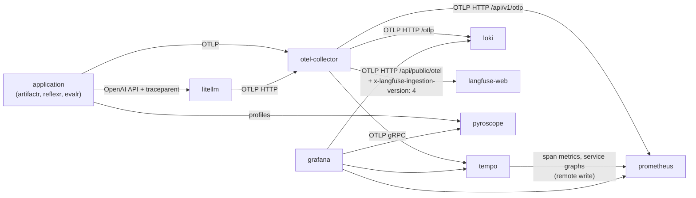

# Observability

The `observability` profile is the telemetry port and its default adapters: an OpenTelemetry Collector that receives everything, Tempo for traces, Prometheus for metrics, Loki for logs, Pyroscope for profiles, and Grafana over all four, with links between them ([ADR-0003](../adr/0003-observability-and-gateway-services.md), [ADR-0007](../adr/0007-how-telemetry-reaches-the-backends.md)).



## Sending telemetry

Applications send OTLP to the Collector and nowhere else, with the standard OpenTelemetry settings:

| Setting | On this machine | On the `stackr` network |
|---|---|---|
| `OTEL_EXPORTER_OTLP_ENDPOINT` | `http://localhost:4318` (HTTP) or `http://localhost:4317` (gRPC) | `http://otel-collector:4318` or `http://otel-collector:4317` |
| `OTEL_EXPORTER_OTLP_PROTOCOL` | `http/protobuf` or `grpc`, to match the port | The same |
| `OTEL_SERVICE_NAME` | The application's name; it becomes `job` in Prometheus and `service_name` in Loki | The same |
| `OTEL_RESOURCE_ATTRIBUTES` | Such as `deployment.environment.name=staging` | The same |

The libraries' `configure_telemetry` (their `[otel]` extras) reads these. Profiles are the exception: applications push them to Pyroscope directly, at `PYROSCOPE_SERVER_ADDRESS` (`http://localhost:4040`), because OTLP profiles are still experimental in the Collector.

The Collector's HTTP receiver accepts requests from browser pages served from `localhost` or `127.0.0.1` on any port, so a front end on this machine can send OTLP too.

## The Collector

The Collector is the one place telemetry is routed, filtered and enriched: replacing a backend is replacing its exporter in `deploy/otel-collector/config.yaml`, and no application changes.

| Signal | Goes to | How |
|---|---|---|
| Traces | Tempo, and Langfuse when the `langfuse` profile runs | OTLP gRPC to `tempo:4317`; OTLP HTTP to Langfuse's `/api/public/otel` |
| Metrics | Prometheus | OTLP HTTP to Prometheus's own OTLP receiver, `/api/v1/otlp` |
| Logs | Loki | OTLP HTTP to Loki's `/otlp` |

Every pipeline runs three processors: `memory_limiter`, which refuses data before the Collector runs out of memory; `resource/environment`, which labels telemetry that doesn't say which environment it comes from with `deployment.environment.name` set to `STACKR_ENVIRONMENT` (`local` by default); and `batch`.

The traces pipeline takes its exporters from `STACKR_TRACES_EXPORTERS`, which `make up` sets from the profiles: `[otlp_grpc/tempo, otlp_http/langfuse]` with `langfuse`, and `[otlp_grpc/tempo]` without it, so a stack without Langfuse doesn't log failed exports. [Collector pipelines](../reference/collector.md) lists every receiver, processor and exporter.

The Collector's own metrics are scraped by Prometheus, for the **Collector health** dashboard.

## Tempo: traces

Tempo 3 runs as a single process, with its data on the `tempo-data` volume. A trace is searchable as soon as it arrives. Search it in Grafana's Explore with TraceQL, such as `{ resource.service.name = "my-app" }`, or through Tempo's API on port 3200.

Its **metrics generator** derives two kinds of metrics from every span and remote-writes them to Prometheus, with exemplars that link back to traces:

- span metrics: `traces_spanmetrics_calls_total` and `traces_spanmetrics_latency_bucket`, labelled by `service`, `span_name`, `span_kind` and `status_code`
- service graphs: `traces_service_graph_request_total`, which Grafana's service map draws

## Prometheus: metrics

Prometheus receives metrics two ways: OTLP from the Collector, through its native OTLP receiver, and remote write from Tempo's metrics generator. It also scrapes the stack's own services (the Collector, Prometheus, Tempo, Loki, Pyroscope and Grafana), so their health shows next to the applications'. It keeps 15 days of data.

Prometheus translates OTLP metrics to its own names with its default rules, and the libraries' dashboards query the translated names:

| OTLP metric (unit) | Kind | In Prometheus |
|---|---|---|
| `artifactr.commands` (`1`) | Counter | `artifactr_commands_total` |
| `artifactr.commit.duration` (`s`) | Histogram | `artifactr_commit_duration_seconds_bucket`, `_sum` and `_count` |
| `artifactr.stream.connections` (`{connection}`) | Up-down counter | `artifactr_stream_connections` |

- `service.name` becomes the `job` label, and `service.instance.id` the `instance` label.
- `deployment.environment.name` and `service.version` are copied from the resource onto every series, as `deployment_environment_name` and `service_version`. The other resource attributes stay on `target_info`.
- A data point's attributes become labels, with dots turned into underscores: `artifactr.command.type` becomes `artifactr_command_type`.

This translation is a contract with the libraries' dashboards, so a change to the `otlp:` settings in `deploy/prometheus/prometheus.yml` is a breaking change for them. The smoke test checks it, by finding its counter as `stackr_smoke_total`.

Samples up to 30 minutes out of order are accepted, since the Collector retries batches.

## Loki: logs

Loki receives OTLP logs at `/otlp`, runs as a single process with its data on the `loki-data` volume, and keeps 7 days of logs. It indexes a few resource attributes, `service_name` among them, as labels, and keeps the rest, including `trace_id` and `span_id`, as structured metadata:

```logql
{service_name="my-app"} | trace_id="4bf92f3577b34da6a3ce929d0e0e4736"
```

## Pyroscope: profiles

Pyroscope 2 runs as a single process, with its data on the `pyroscope-data` volume. Applications push profiles to <http://localhost:4040>, or `http://pyroscope:4040` on the network, with a Pyroscope SDK. Grafana shows them, and links a span to its service's CPU profile.

## Grafana

Grafana is at <http://localhost:3000>, as `admin` with `GRAFANA_ADMIN_PASSWORD` from `.env`. Everything in it is provisioned from `deploy/grafana/`, so a new stack starts with the same data sources, links and dashboards ([Grafana provisioning](../reference/grafana.md)).

**Data sources** have fixed uids, which dashboards and links refer to: `prometheus` (the default), `tempo`, `loki` and `pyroscope`. They can't be edited in the UI.

**Links between signals:**

- from a span to its service's logs around the span's time, filtered to the trace (Loki)
- from a span to its service's request rate, error rate and p95 latency, from the span metrics (Prometheus)
- from a span to its service's CPU profile (Pyroscope)
- from a log line with a `trace_id` to the trace
- from a histogram's exemplar to the trace that produced it
- Tempo's service map and node graph, from the service graph metrics

**One minute between samples.** Applications push metrics through the Collector at the OpenTelemetry SDK's default interval, once a minute. The Prometheus data source says so (`timeInterval: 60s`), so `$__rate_interval` always covers several samples and rate panels have data.

### Dashboards

Dashboards are files under `deploy/grafana/dashboards/`, one Grafana folder per directory, rescanned every 30 seconds and read-only in the UI:

- **`stackr/`** is committed. **Collector health** (`stackr-collector`) shows what the Collector receives, what each backend receives, send failures, queues, memory and CPU, and whether each of the stack's services is up.
- **`artifactr/` and `reflexr/`** are the libraries' own dashboards, downloaded at the releases pinned in `versions.env`, and gitignored.

### The libraries' dashboards, by version

Each library publishes its dashboards with every release, as one archive of dashboard JSON files:

```text
https://github.com/alexnodeland/<library>/releases/download/v<version>/<library>-dashboards-<version>.tar.gz
```

`versions.env` pins the release to use for each library, with an optional sha256 of the archive:

```bash
ARTIFACTR_DASHBOARDS_VERSION=0.2.0
ARTIFACTR_DASHBOARDS_SHA256=<sha256 of the archive>
```

`make dashboards`, which `make up` runs first, downloads each pinned archive, checks its sha256 when one is pinned, and replaces the library's folder with its JSON files. A library with no version pinned is skipped. A failed download is a warning, so `make up` works offline; `uv run scripts/fetch-dashboards --strict` makes it an error. `STACKR_DASHBOARDS_URL`, a URL with `{library}` and `{version}` in it, downloads from somewhere else, such as a library's own build.

To move to a new release, change its version and sha256 in `versions.env`, then run `make dashboards` and `make smoke`. [Pinned versions](../reference/versions.md) shows what is pinned now.
