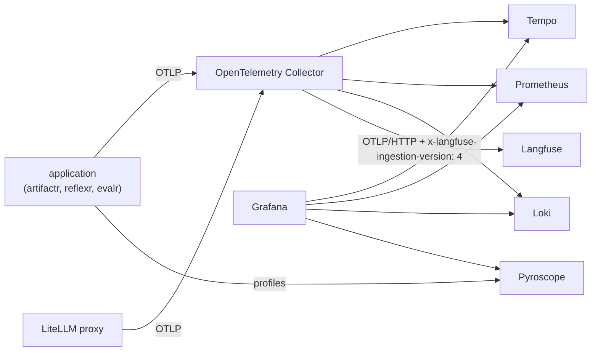

# RFC-0001: v0.1 implementation plan

**Status:** Accepted
**Author:** Alex Nodeland
**Created:** 2026-09-28
**Discussion:** accepted on 2026-09-28
**Siblings:**
- [artifactr RFC-0002](https://github.com/alexnodeland/artifactr/blob/main/docs/rfcs/0002-observability-feedback-and-evaluation.md) and [reflexr RFC-0002](https://github.com/alexnodeland/reflexr/blob/main/docs/rfcs/0002-observability-feedback-and-evaluation.md) define what the libraries emit, and the extras that connect them to this stack.
- [evalr RFC-0001](https://github.com/alexnodeland/evalr/blob/main/docs/rfcs/0001-v0.1-implementation-plan.md) evaluates on it.

## Summary

stackr is the **infrastructure template** for applications built on artifactr, reflexr and evalr ([artifactr ADR-0032](https://github.com/alexnodeland/artifactr/blob/main/docs/adr/0032-libraries-and-the-stackr-template.md)). It has two parts:

- **The stack:** the services every such application runs on, as one Docker Compose project with profiles:
  - local Supabase
  - the LiteLLM proxy
  - an OpenTelemetry Collector
  - Grafana's LGTM stack with Pyroscope
  - self-hosted Langfuse
- **The application template:** a Copier template that scaffolds a new application using artifactr, reflexr or both, already wired to the stack. That includes auth, storage, telemetry, the LLM gateway, feedback and evals.

It starts with Docker Compose for local development and single hosts. Kubernetes (Helm) and Terraform come later, from the same configuration.

## Motivation

Every application on the libraries needs the same infrastructure, and the libraries themselves need it to be developed and evaluated:
- a database with authentication
- an LLM gateway with routing, budgets and guardrails
- tracing, metrics, logs and profiles
- a place for LLM traces, scores and datasets

Assembling it by hand for each project is slow and inconsistent, and the libraries' dashboards, telemetry conventions and LiteLLM metadata only pay off when the stack is set up to use them.

## Design

### Services

| Profile | Services | Why |
|---|---|---|
| `supabase` (managed by the Supabase CLI) | PostgreSQL, Auth, Storage, Realtime, Studio, and its API gateway | The database platform. The libraries' SQL storage uses its PostgreSQL unchanged; Auth issues the JWTs applications resolve actors from; Langfuse and LiteLLM keep their databases on the same instance |
| `gateway` | LiteLLM proxy, Redis (routing state and caching) | Model groups, fallbacks, load balancing, budgets and rate limits per tenant team, and guardrails |
| `observability` | OpenTelemetry Collector, Prometheus, Tempo (with its metrics generator), Loki, Pyroscope, Grafana | The full-application view: traces, metrics, logs and profiles, with provisioned dashboards |
| `langfuse` | Langfuse web and worker, ClickHouse, MinIO (Redis shared with the gateway) | LLM traces, sessions, scores, datasets and experiments |
| `app` | The scaffolded application | Runs the application beside its infrastructure |

- **Local Supabase through its CLI.** The template holds a `supabase/` project (configuration and migrations), started with `supabase start`, which manages its own containers. The Compose services join Supabase's Docker network, so both halves reach each other by name. The Supabase CLI is the official local workflow, and its versions are managed with it.
- **Images are pinned,** and Dependabot keeps them current.
- **Secrets** come from a `.env` file generated by a setup script, never committed. Defaults are for local use only.

### The telemetry path

- **The Collector** receives OTLP from applications and from the LiteLLM proxy, so one trace crosses the application and the gateway. It fans out to Tempo, Prometheus, Loki and Langfuse, and adds the header Langfuse needs.
- **Tempo's metrics generator** produces span metrics and service graphs.
- **Grafana** is provisioned with data sources, trace-to-logs, trace-to-metrics and trace-to-profiles links, and the libraries' dashboards. Those dashboards are published as release assets of each library and pinned by version here.

### The LLM gateway

- The LiteLLM configuration follows the style already in use: model aliases (`claude-sonnet`, `gpt-4o`, `gemini-2.5-pro`), a wildcard route for OpenRouter, and routes to local servers such as LM Studio and oMLX. The additions are:
  - **Model groups** with fallbacks and load balancing, such as a `default` group that falls back across providers.
  - **Teams per tenant**, with virtual keys, budgets and rate limits. A setup script creates a team for a new tenant.
  - **Guardrails** (PII masking, prompt-injection checks) defined once and selected per request by the libraries' `[litellm]` extras, from each workspace's or rule's policy.
  - **Telemetry to the Collector,** continuing the application's trace.
- The master key stays in `.env`; applications use team keys.

### The application template

`copier copy gh:alexnodeland/stackr/template my-app` asks which libraries to use and generates an application with:

- a FastAPI server mounting the libraries' surfaces, and an example artifact type or rule
- `resolve_actor` verifying Supabase JWTs, with the tenant taken from the token's claims
- SQL storage on Supabase's PostgreSQL, with the libraries' migrations run at startup
- `configure_telemetry(...)` pointed at the Collector, with Langfuse enabled
- agents on `litellm_model("default")` through the gateway
- feedback types and an `evals/` directory with a starter evalr experiment
- a Compose `app` profile, a dev container, CI, and the family's quality gates

`copier update` pulls later improvements into existing applications.

### Validation

CI checks the stack two ways:
- **Statically:** Compose configuration, Collector and Tempo configuration, Grafana provisioning and dashboard JSON, and the LiteLLM configuration.
- **With containers:** a smoke job starts the core profiles, scaffolds an application from the template, and checks that one request produces a trace in Tempo and in Langfuse, and a metric in Prometheus.

### Phases

| Phase | Deliverable | Exit criteria |
|---|---|---|
| 0. Foundation | Repository, process documents, CI for static validation | CI green |
| 1. Observability | Collector, LGTM, Pyroscope, Grafana provisioning | A test span and metric appear in Grafana |
| 2. Langfuse | Self-hosted Langfuse, the Collector route with the ingestion header | A test trace appears in Langfuse |
| 3. Supabase | The `supabase/` project, networking with Compose, databases for Langfuse and LiteLLM | Services reach Supabase by name |
| 4. Gateway | LiteLLM with model groups, teams, guardrails and telemetry | A request through a team key is traced and budgeted |
| 5. Application template | The Copier template, with the libraries' extras wired in | A generated application passes its own CI and the smoke test |
| 6. Docs and brand | A documentation site in the family's style | Strict build in CI |

## Drawbacks

- Many services. Profiles keep what runs to what is needed.
- The Supabase CLI manages its own containers outside Compose, so starting the stack takes two commands. A `make up` wraps them.

## Alternatives

- **Plain PostgreSQL instead of Supabase:** simpler, but no authentication, storage or realtime, and no path to Supabase's hosted platform.
- **Supabase's self-hosting Compose file, vendored:** one Compose project, but a large file to maintain against Supabase's releases. The CLI is the official local workflow.

## Unresolved questions

- **Production targets:** Kubernetes with Helm, Terraform for managed services, or hosted Supabase and Langfuse. After v0.1.
- **Further Supabase integration:** Auth flows in the template, Edge Functions, more databases, vector indexing (pgvector), and graph queries. Tracked as issues.

## Tracking

- [x] Phase 0: foundation
- [ ] Phase 1: observability
- [ ] Phase 2: Langfuse
- [ ] Phase 3: Supabase
- [ ] Phase 4: gateway
- [ ] Phase 5: application template
- [ ] Phase 6: docs and brand
