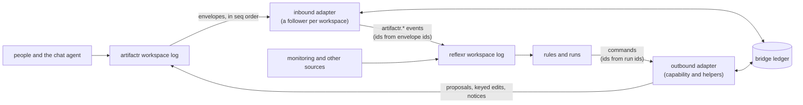

# RFC-0002: The combined system

**Status:** Accepted
**Author:** Alex Nodeland
**Created:** 2026-09-29
**Discussion:** [#30](https://github.com/alexnodeland/stackr/pull/30), from [issue #8](https://github.com/alexnodeland/stackr/issues/8); accepted on 2026-09-29, with the decisions in [Decision points](#decision-points)
**Siblings:**

- [reflexr ADR-0003][r-adr-0003] keeps the libraries independent and leaves the adapters between them to this system. [artifactr ADR-0032][a-adr-0032] makes it an application built from stackr's template.
- [reflexr #21][r-21] (runtime rule management) is what lets a rule proposed in chat go live.
- [evalr RFC-0001](https://github.com/alexnodeland/evalr/blob/main/docs/rfcs/0001-v0.1-implementation-plan.md) provides the measures it is judged by.

## Summary

The combined system is a chat and artifact workspace (artifactr), an event and rule engine (reflexr) and evaluation (evalr), working over one shared context: the same tenant and workspace ids name the same context in both libraries ([reflexr ADR-0016][r-adr-0016]). It is an application generated from stackr's template.

This RFC proposes a **bridge**: a small package with two adapters over the libraries' public APIs. The inbound adapter turns selected artifactr events into reflexr events. The outbound adapter lets reflexr runs act in artifactr, mostly by proposing changes for people to review. The RFC also covers delivery guarantees, loop control, sessions and traces, rules drafted in chat, evaluation and security.

The maintainer settled seven decisions (D1 to D7) on 2026-09-29. The bridge is **relayr**, a new sibling repository, and its event names wait for [reflexr #45][r-45] (D6).

## Motivation

The template already generates an application with both libraries mounted side by side, on one database and one telemetry setup ([ADR-0011](../adr/0011-the-application-template-in-detail.md)). But the two halves don't talk to each other. A rule can't see what people say in a thread, and a run can't put its result in front of the people it concerns. Each application that wants this would write its own glue, and would meet the same hard parts:

- duplicate and lost deliveries
- rules that trigger themselves
- two kinds of session that don't line up
- events that anyone could forge

Both libraries were built with aligned conventions for exactly this reason (reflexr ADR-0003). Issue #8 records the decision to design the combined system as an RFC here, and to pause for sign-off before building it.

## Scenarios

### 1. A chat request becomes a rule

1. In a thread, a person writes: "Whenever a deploy to production fails, add it to the incident log and tell me here."
2. The chat agent drafts a `rule` artifact. Its data is a reflexr `Rule` as JSON ([reflexr ADR-0006][r-adr-0006]). The artifact type's write policy is `propose`, so the draft arrives as a proposal.
3. The proposal shows a replay preview, "would have fired 3 times in the last 7 days", computed without running anything.
4. The person accepts it.
5. A bridge rule checks the acceptance against artifactr, then installs the rule in reflexr through #21's API. It records where the rule came from: the artifact and version, the proposal and who approved it.
6. A notice in the thread says the rule is live. The notice does not start a turn.

### 2. A run's proposal is reviewed in the thread

1. A monitoring source publishes `deploy.completed` into reflexr. The rule `runbook-updater` fires, and its agent compares the deploy with the service's runbook.
2. Through the bridge, the run proposes an edit to the runbook artifact in the service's thread. The actor is `reflexr:runbook-updater`, and the proposal id is derived from the run.
3. The run is retried after a timeout. Its second attempt proposes the same change with the same id, so no duplicate appears.
4. A person accepts it with one line changed.
5. The resolution comes back to reflexr and joins the run's causal chain. An evaluator records the outcome, "edited", as feedback on the run.
6. The proposal records the run's trace, so from the thread you can open the run that wrote it.

### 3. Rules keep an incident timeline

1. `alert.fired` events from monitoring open an incident. The rule `open-incident` creates a thread and a `timeline` artifact. The timeline's write policy is `direct`, and its id is derived from the chain.
2. The rule `timeline-entry` adds an entry for each alert, deploy and message in the incident thread. Each entry is keyed by the event that caused it, so a retried run rewrites the same entry instead of adding a second one.
3. People correct the timeline directly. `timeline-entry` ignores changes made by the bridge's own actor, and every change it causes continues its chain, so it can't feed on itself.
4. When the incident is resolved, reflexr's `time_to_resolution` measures the chain. evalr's rewrite measure shows how much of the timeline people had to rewrite.

## Design

### Overview

The bridge runs inside the application's process, next to both libraries. Neither library imports the other, and the bridge reaches neither library's internals. The ledger is the bridge's own storage. It holds each follower's cursor and lease, and the map from artifactr writes back to the reflexr runs that made them.

### Where the code lives

The bridge is a new package that depends on both libraries (**D1**: a new sibling repository, **relayr**). It holds:

- the two adapters
- the bridged event types
- the ledger, with in-memory and SQL adapters
- the `rule` artifact type and the rule-install rule (phase 5)
- the feedback types and the proposal-outcome evaluator (phase 6)
- the telemetry links and tags (phase 4)

The template's `both` variant gains a `bridge` question that wires it in. The combined system itself is a product repository generated from the template, as artifactr ADR-0032 says.

### Ports and adapters

The bridge follows [ADR-0005](../adr/0005-ports-and-adapters-for-the-stack.md) and [artifactr ADR-0034][a-adr-0034]. It uses only what each library exposes to applications:

| Library | Public API used | For |
|---|---|---|
| artifactr | `Workspaces.open(...)`, `Workspace.read(after_seq=)` and `subscribe(...)` | following a workspace's log |
| artifactr | `Workspace.as_actor(...).commit(...)` | proposals, creates, keyed edits and notices |
| artifactr | `Runner.send(...)` | a message that is meant to start a turn, only where a rule is allowed to (D7) |
| reflexr | `Workspaces.open(...)`, `Workspace.publish(event, id=, correlation_id=)`, `caused_by(...)` | publishing bridged events, inside a chain when a run caused them |
| reflexr | an action's `Reaction`, and a pydantic-ai capability | carrying out a run's artifactr commands |
| reflexr | `Workspace.give_feedback(..., on=)` | proposal outcomes, as feedback on the run that proposed |
| reflexr | #21's rule management API | installing rules drafted in chat |

The bridge has two ports of its own. The **ledger** is storage: an in-memory adapter for tests, and an SQL adapter whose prefixed tables live in the application's schema, like the libraries' tables. **Policies** are application callbacks: each rule's allowlist, and who may install a rule. Everything is tested against both libraries' in-memory storage, with one contract test run against both ledger adapters.

### Inbound: artifactr to reflexr

- **One follower per workspace.** It holds a lease in the ledger, so only one process follows each workspace. It reads envelopes in `seq` order and publishes the selected ones into the reflexr workspace with the same tenant and id. Only then does it advance its cursor.
- **Ids come from the artifactr envelope id,** so publishing an event twice appends nothing (reflexr's `publish` is idempotent by id).
- **Names come from reflexr's namespaces.** reflexr's registry is process-global with flat names, and its own facts `run_started` and `feedback_given` would collide with artifactr's. [reflexr #45][r-45] decides how event types are namespaced before phase 1 starts (**D6**), and the bridged types use its scheme. This RFC writes them as `artifactr.message_posted` and so on, as placeholders.
- **The actor** on each bridged envelope is `SourceActor("artifactr")`, since the bridge published it. The artifactr actor goes in an `author` field, so rules can filter on who did it.

The default set:

| artifactr event | Bridged as | Notes |
|---|---|---|
| `message_posted` | `artifactr.message_posted` | thread, message id, content, author |
| `artifact_created`, `artifact_changed`, `artifact_archived` | the same names, prefixed | kind, id, version, summary, and the data or patch |
| `proposal_created`, `proposal_resolved` | the same names, prefixed | with `proposed_by`, used for loop control and evaluation |
| `run_ended` | `artifactr.turn_ended` | so that "run" means one thing inside reflexr |
| `feedback_given` | `artifactr.feedback_given` | |
| the application's `app_event`s and artifact kinds | projections the application registers | a mapping function per type |

- **Not bridged:** tool calls and returns, run starts and pauses, deferred answers, and focus and mode changes. They are noisy, and tool arguments can hold data that rules have no need to see. Live frames never reach the log anyway.
- **Failures:** if a projection raises, or an event fails validation, the envelope is dead-lettered in the ledger and the follower moves on, as reflexr does per rule. A continued chain that would exceed the depth limit (see [Loop control](#loop-control)) is recorded the same way.
- **Starting followers:** a follower starts the first time a workspace is used, through the libraries' `authorize` hook, as the template's `Mirrors` does for feedback. At startup the bridge also resumes every workspace that has a cursor in the ledger. A workspace that has never been used since the bridge was installed is found only once someone uses it, because artifactr can't list workspaces (a prerequisite).

### Outbound: reflexr to artifactr

- **The surface:** agent actions get a pydantic-ai capability, and function actions get plain helpers with the same operations: propose a change, create an artifact or a thread, make a keyed edit, post a notice, and (if allowed) send a message that starts a turn.
- **The actor** is `ExternalAgentActor(client_id="reflexr:<rule>", name=<rule>)` (**D2**). artifactr then applies its own rules to it:
  - its writes become proposals under a `propose` write policy or in a thread in suggest mode
  - it can't resolve its own proposals
  - it can't record run facts
- **Proposals by default.** Writes go through `ProposeChange`, unless the rule's allowlist grants direct writes for an artifact kind. Even then, artifactr's write policy and the thread's mode still apply.
- **Never `respond_to_proposal`.** The adapter has no way to send it, whatever the allowlist says. Otherwise one rule could accept another rule's proposal, since each rule is a different participant.
- **Where it acts:** only in the artifactr workspace with the same tenant and id as the run's workspace. It acts in the thread the chain came from, or in one the rule names or creates.
- **Ids** are derived from the run id, which is the run's idempotency key ([reflexr ADR-0027][r-adr-0027]), plus a step counter. This works the way `reaction.emit` derives event ids.
- **Rejections:**
  - `VersionConflict`: re-read the artifact and retry within the attempt.
  - `Forbidden`, `NotFound` and `ValidationFailed`: a permanent `RunFailure` with the code as its reason.
  - `InvalidState` on a create whose derived id already exists: counted as already done.

### Delivery guarantees and idempotency

Delivery is at least once in both directions. The effects are exactly once wherever the target is idempotent by id. There is no distributed transaction, and none is needed.

| Path | Delivery | Effect | How |
|---|---|---|---|
| artifactr event to reflexr event | at least once | exactly once | The bridged event id comes from the artifactr envelope id, and reflexr's `publish` is idempotent by id |
| run to artifactr create or proposal | at least once (runs retry) | exactly once | Ids come from the run. artifactr rejects a duplicate create or proposal with `InvalidState` |
| run to artifactr edit | at least once | exactly once, for keyed patches | The helpers write keyed patches (set an entry by key, never append), so repeating one changes nothing |
| run to artifactr message or notice | at least once | exactly once, with the ledger's read-back | artifactr core never checks `message_id` (`_post_message` in `core/rules.py`). Its `command_id` check is in memory and per process |
| proposal outcome to reflexr feedback | at least once | exactly once | Keyed by the proposal id in the ledger |

**Read-back** covers the gap for messages until artifactr checks message ids durably (a prerequisite). Before posting, the bridge records the derived message id and the thread's current `seq` in the ledger. On a retry, it looks for that message id in the thread after that `seq`, and posts only if it isn't there.

### Loop control

Three kinds of loop are possible:

- **Echo:** a rule reacts to its own write.
- **Ping-pong:** two rules keep answering each other, or a rule and the chat agent do.
- **Runaway turns:** a message from a rule starts a turn, and that turn's edits fire the rule again.

Five mechanisms keep them in check:

1. **Causation carries across.** The ledger maps every artifactr write the bridge made (by its derived ids), and every turn a bridge message started (by the artifactr run id), back to the reflexr run. When the follower bridges an event from one of them, it publishes the event with the run's causation (`caused_by(run.causation, correlation_id=run.correlation_id)`). The event continues the chain at depth + 1, and reflexr's depth limit (8 by default, [reflexr ADR-0010][r-adr-0010]) ends any loop.
2. **A person's answer joins the chain without adding depth.** A person who accepts or rejects a bridge proposal is a new cause. The resolution is published with the chain's `correlation_id`, but not with the run's causation. That keeps the story in one chain, which evaluation needs.
3. **Rules can see the author.** Each bridged event says who acted in artifactr, so a rule can ignore the bridge's own writes. The example rules do.
4. **Budgets bound what depth doesn't:** rule throttles, reflexr's usage limits, and the tenant's gateway budget (a team per tenant, stackr [ADR-0010](../adr/0010-the-llm-gateway.md)).
5. **Notices don't start turns** (D7).

### Chains and threads

A thread is a conversation that can run for weeks. A chain is one causal story, from a first event to everything it caused. Decided (**D3**): **a thread is never a chain.**

- Each bridged event from a person starts a chain of its own, as any source event does.
- A chain that begins with a thread event carries the thread id as a field and as a `thread:` tag.
- The chain reaches back into the thread through proposals and notices posted there.

### Sessions and trace links

Today, each library has its own idea of a session:

| | artifactr | reflexr |
|---|---|---|
| Session | the thread ([artifactr ADR-0035][a-adr-0035]) | the causal chain, `correlation_id` ([reflexr ADR-0018][r-adr-0018] and [ADR-0024][r-adr-0024]) |
| Trace | a turn is its own trace | a run attempt |
| Langfuse user | who requested the turn, if a user | the last matched event's actor, if a user |
| Tags | tenant, workspace, the kinds of artifact in focus | tenant, workspace, rule |

Decided (**D4**): **the sessions are linked, not continued.**

- **Separate traces and sessions,** with links between them. A chain does not join the thread's Langfuse session.
- **reflexr to artifactr works today.** Bridge commands run inside the run's span, so proposals and revisions record the run's trace ([artifactr ADR-0033][a-adr-0033]). A turn started by a bridge message is a new trace, linked to the run's span (artifactr ADR-0035).
- **artifactr to reflexr needs `traceparent` on artifactr envelopes.** reflexr's envelopes carry one, but artifactr's don't (a prerequisite). With it, a bridged event carries the trace context of the turn or request that caused it, and the run links back to it.
- **Tags and metadata:**
  - A run that starts from a thread event is tagged `thread:<id>`.
  - A turn started by the bridge is tagged `chain:<correlation id>` and `rule:<name>`.
  - LiteLLM metadata follows the same tags.
- **The Langfuse user** of a run started from a bridged event is the event's author. reflexr's `langfuse_run` would take the user from the envelope's actor, which is the bridge's source.
- **No library change is needed for tags or the user.** Each library takes a context entered around every turn or run (artifactr's `turn_context`, reflexr's run context). The bridge wraps their Langfuse contexts to add its tags and set the user.
- **Model history stays apart.** A chain never joins the thread's model history. The agent learns about a chain's work through change notes on its next turn, through proposals, and through notices.

### Rules from chat

This part depends on [reflexr #21][r-21]. Today, rules and schedules are the application's code, shared by every tenant (reflexr ADR-0016, amended). A rule drafted in chat has to be data that belongs to one tenant, is versioned, and is installed through an API.

1. **Draft.** The chat agent writes a `rule` artifact: a reflexr `Rule` as JSON, with write policy `propose`. The artifact type validates the draft with `Rule.check(events=..., actions=...)`, against the application's registered event types and an allowlist of actions that chat rules may use. `InvalidRule` lists every problem, and the agent can fix them.
2. **Preview.** The bridge replays the reflexr workspace's recent log through reflexr's pure `core.evaluate`, which runs no actions. The agent puts the result ("would have fired N times in the last 7 days") in the proposal's rationale.
3. **Accept.** A person accepts the proposal, possibly with edits.
4. **Check.** The bridge's own rule, `install-rule`, fires on `artifactr.proposal_resolved`. It never trusts the bridged event, and re-reads artifactr to confirm that:
   - the proposal was accepted
   - the artifact is at that version
   - the approver is a user allowed to install rules
5. **Install.** It installs the rule through #21's API, with its provenance: the artifact, the version, the proposal and the approver.
6. **Confirm.** A notice in the thread names the rule and its version.

Changing the rule means another proposal on the artifact, which installs a new version. Archiving the artifact disables the rule.

**Limits** on chat rules:

- a throttle is required
- the workspace's depth limit can't be raised
- reflexr's usage limits and the tenant's gateway budget apply
- only registered actions from the allowlist, never code

**Audit** spans both logs. artifactr's log holds the draft, the proposal and the acceptance. reflexr's store holds the installed versions, and each version records the artifactr ids it came from.

**D5** decides which one is the source of truth. Decided: the artifact is the reviewed record, and reflexr's store holds the running definition. If the rule is changed in reflexr directly, for example by an operator, the bridge proposes the same change to the artifact, so the two don't drift apart silently.

### Evaluation

| Measure | From | Lands in |
|---|---|---|
| Proposal outcome per run: accepted, edited or rejected | `artifactr.proposal_resolved` for a bridge proposal. An evaluator of the log gives feedback on the run that proposed, as an `EvaluatorActor` | reflexr feedback, then a Langfuse score on the run |
| Acceptance and edit rates per rule | the proposal outcomes | Langfuse and Grafana |
| Chat-to-rule conversion, and rule survival | rule artifacts proposed, accepted, still enabled after 30 days | the combined experiment |
| Bridge lag and end-to-end latency | from the artifactr commit to the reflexr publish, and from the first event to its effect in the thread | bridge metrics in Prometheus |
| Timeline rewrite rate | evalr's `measure_rewrites` over the timeline artifact's history | the combined experiment |
| Chain time to resolution | `reflexr.evals.time_to_resolution` | the combined experiment |
| Cost per chain, including the turns it caused | the `chain:` tag on bridge-started turns, and LiteLLM spend | Langfuse |

The template's `evals/` gains a combined experiment that replays the example scenarios. Online judging of proposals uses evalr's sampling by run id ([evalr ADR-0009](https://github.com/alexnodeland/evalr/blob/main/docs/adr/0009-online-evaluation.md)).

One gap has no home yet. evalr's `Session` is "a conversation or a causal chain" with a single id, so nothing measures a thread together with the chains it started. That is an unresolved question.

### Security

- **Forged bridged events.**
  - The risk: bridged types are registered in reflexr like any other type, so any client allowed to publish could send a fake `artifactr.proposal_resolved`. `Workspaces(emitted=[...])` reserves types to runs, but nothing reserves a type to one source (a prerequisite).
  - Until that exists, bridge rules check that the envelope's actor is `SourceActor("artifactr")`, and the application must never resolve a client to that source.
  - Either way, anything that matters re-reads artifactr before acting. The install rule never acts on a bridged event alone.
- **Actor permissions.**
  - artifactr checks actors on writes to artifacts, proposals and run facts. An evaluator may only give feedback.
  - It does not check `CreateThread`, `PostMessage` or `GiveFeedback`. For those, the bridge's per-rule allowlist is the only limit, so it is required rather than optional, and it defaults to proposals and notices in the chain's own thread.
- **Tenancy.** The bridge acts only in the same tenant and workspace as the run. Rules installed from chat belong to one tenant, and #21's store must not list them to other tenants, unlike code rules, which every client may read.
- **Untrusted content.** A bridged message is input that a person or another agent wrote. Rule agents that read it get the gateway's prompt-injection guardrail through their rule's policy, and their writes are proposals by default.

### The template

When `libraries` is `both`, a new `bridge` question (yes by default) adds:

- the bridge, pinned to a revision like the libraries (`bridge_rev`)
- the ledger's tables in the application's schema
- followers started through the `authorize` hook and resumed from the ledger at startup
- the outbound capability registered for the example rules
- the incident timeline example (scenario 3), with tests

`make smoke-app` then also checks that a message crosses into reflexr, and that a run's proposal crosses back.

## Decision points

The maintainer decided these on 2026-09-29. Each option table below marks the choice in bold.

| # | Decision | Decided |
|---|---|---|
| D1 | Where the bridge lives, and its name | A new sibling repository and package, named **relayr** |
| D2 | The outbound actor | `ExternalAgentActor(client_id="reflexr:<rule>")`, one participant per rule |
| D3 | Chains and threads | A thread is never a chain; chains carry the thread as a field and tag |
| D4 | Sessions: linked or continued | Linked, not continued |
| D5 | Where a rule's source of truth lives | The artifact is the reviewed record; reflexr's store holds the running definition |
| D6 | Bridged event names before reflexr #45 | Decide #45 first; phase 1 waits for it, and uses its namespaces |
| D7 | May a rule start a turn? | Notices by default; starting a turn is a per-rule permission |

### D1: where the bridge lives, and its name

| Option | For | Against |
|---|---|---|
| **A new sibling repository and package (decided)** | Its own tests, releases and pinned revision, like the libraries. Any application from the template can use it | One more repository to maintain |
| A package inside stackr | One fewer repository | stackr becomes a library host, and its releases get tied to the stack's |
| Generated code in the template only | Nothing to release | Every application owns a copy of code with idempotency and security invariants, and `copier update` has to merge fixes into code that has drifted |
| Only in the product repository | Fastest start | Other applications can't reuse it, and the template can't generate it |
| An extra in one library | No new package | Ruled out by reflexr ADR-0003: neither library imports the other |

The name is **relayr**: it relays events and commands between the two libraries, and fits the family's names. `bridgr` and `linkr` were considered; "link" already means trace and span links in this design.

### D2: the outbound actor

| Option | For | Against |
|---|---|---|
| **`ExternalAgentActor`, one `client_id` per rule (decided)** | artifactr's proposal rules apply as they do for any outside agent. Attribution is per rule | Rules are different participants, so the adapter must forbid resolving proposals itself |
| `SystemActor` | Simple | Writes apply directly and can record run facts. Far more power than a rule needs |
| artifactr's `AgentActor` | Looks like the thread's agent | Impersonates the chat agent, and mixes up artifactr's runs |
| The rule's approver, as a user | People know who that is | Acts with a person's authority, and misattributes every write |

### D3: chains and threads

| Option | For | Against |
|---|---|---|
| **A thread is never a chain (decided)** | Chains stay short, and chain measures (time to resolution, cost per chain) keep their meaning | Linking the two needs tags |
| A thread is one chain | One id for everything | A chain that lasts weeks. `chain_events` returns the whole thread, and chain measures stop meaning anything |
| A chain per turn | Groups the events one turn caused | The follower has to track turns. Could come later as a refinement |

### D4: sessions, linked or continued

| Option | For | Against |
|---|---|---|
| **Linked, not continued (decided)** | No change to either library's session model. Scores stay with what they judge | Two sessions to open for one story, joined by tags and links |
| One Langfuse session for a thread and the chains it starts | One view | Needs a session resolver port in reflexr, mixes chain and thread scores, and a chain fed by several threads has no single session |
| The chain continues the conversation (shares the model history) | The agent sees everything | A second author inside the conversation, with none of the thread's review |

### D5: where a rule's source of truth lives

| Option | For | Against |
|---|---|---|
| **Artifact for review, reflexr's store for running, with provenance both ways (decided)** | Reviewed and discussed where people work, and run where rules run | Two records to keep in step, so drift has to be detected |
| reflexr's store only; the artifact is a draft, archived once installed | One record | No review trail in the workspace, and people can't see or change a live rule from chat |
| The artifact only; reflexr reads rules from artifactr | One record | reflexr would depend on artifactr at runtime, against ADR-0003 |

### D6: bridged event names before reflexr #45

| Option | For | Against |
|---|---|---|
| Prefix now (`artifactr.message_posted`), move to #45's namespaces later (recommended in the draft) | Works today, since the registry accepts dotted names | A rename when #45 lands. Rules from chat will name these types, so the move needs a mapping |
| **Decide #45 first (decided)** | Right the first time: no rename, and no mapping for rules that name the old types | Phase 1 waits for a wire-format decision in reflexr |

### D7: may a rule start a turn?

| Option | For | Against |
|---|---|---|
| **Notices by default; starting a turn is a per-rule permission (decided)** | Most rules only need to inform people. Turns cost model calls and can loop | A rule that needs the agent must say so |
| Every bridge message starts a turn, as messages from the surfaces do | Uniform | Each notice becomes a model call, and loops get much more likely |

A notice is committed directly, without `Runner.send`, so it starts no turn. A notice posted while a turn is running is still passed to that turn, though, and nothing marks it as a notice for other clients. That gap is a prerequisite.

## Prerequisites

| Prerequisite | Library | Issue | Needed by | Until then |
|---|---|---|---|---|
| Namespaced event types | reflexr | [#45][r-45] | phase 1 (D6) | phase 1 waits |
| Runtime rule management: per-tenant, versioned, installed through the API, not listed to other tenants | reflexr | [#21][r-21] | phase 5 | no rules from chat |
| Telemetry setup that composes across both libraries, polling without a trace per poll, and mirror cursors | reflexr, artifactr | [reflexr #62][r-62], [artifactr #50][a-50] | phase 4 | links and tags, without the combined setup |
| `traceparent` on artifactr envelopes | artifactr | [#60][a-60] | phase 4, for links in the artifactr-to-reflexr direction | tags only, in that direction |
| Durable message idempotency: core checks `message_id` | artifactr | [#61][a-61] | phase 2 | the ledger's read-back |
| Reserved publishers: a type only one source (or runs) may publish | reflexr | [#72][r-72] | phase 5 | bridge rules check the envelope's actor, and re-read artifactr |
| Workspace discovery: list a tenant's workspaces | artifactr | [#62][a-62] | phase 3 | followers start on first use, and resume from the ledger |
| Notices that don't start or steer a turn, marked as notices | artifactr | [#63][a-63] | phase 2 | direct commits, which start no turn but still reach a running one |

## Phases

| Phase | Deliverable | Exit criteria |
|---|---|---|
| 1. Inbound adapter (after reflexr #45) | The relayr package, the bridged event types, the follower with its lease, cursor and dead letters, and the ledger with both adapters | An artifactr message fires a reflexr rule exactly once, across a restart and a redelivery |
| 2. Outbound adapter and loop control | The capability and helpers, allowlists, derived ids, keyed patches, read-back, and chain continuation | Under forced retries, a rule's proposal and notice each appear once. Two rules that answer each other stop at the depth limit |
| 3. Template option, example and smoke test | The `bridge` question, the incident timeline example, and `make smoke-app` extended | A generated application passes its CI, and the smoke test sees an event cross each way |
| 4. Telemetry links and tags | Span links, `thread:` and `chain:` tags, and the Langfuse user (after reflexr #62 and artifactr #50) | In Tempo, a turn started by a run links to the run's span. In Langfuse, each session carries the other's tag |
| 5. Rules from chat | The `rule` artifact type, validation, preview, the install rule, and provenance (after reflexr #21) | A rule drafted in a thread goes live only after a person accepts it, and a forged `artifactr.proposal_resolved` installs nothing |
| 6. Evaluation | Proposal-outcome feedback, the measures, and a combined experiment in the template's `evals/` | The example's experiment reports acceptance, rewrite rate and time to resolution |
| 7. Docs, ADRs and the product repository | An ADR for each decision, stackr's docs, and the product repository generated from the template | The product repository passes its CI on the stack |

## Drawbacks

- **One more package** to release and pin, and one more log follower in each application.
- **Two logs for one story.** Debugging moves between two logs and two sessions. Links and tags help, but there is more to read.
- **Exactly once depends on discipline.** It rests on derived ids and keyed patches. A rule allowed to make unkeyed direct edits gets at-least-once behaviour.
- **Chat rules hand tenants behaviour that runs.** It is bounded by allowlists, throttles, budgets and review, but it is a new surface to defend.
- **It waits on the libraries.** Phases 4 and 5 can't finish until their prerequisites land.

## Alternatives

- **One library builds on the other**, such as reflexr reading artifactr's log. reflexr ADR-0003 ruled this out.
- **A shared kernel** both libraries import. ADR-0003 deferred this until two working implementations show it pays. The bridge could become the evidence either way.
- **A bridge over the network surfaces** (MCP or WebSocket clients) instead of in process. It would work when the libraries run in separate deployments, but it adds authentication and reconnection, and loses the in-process handles that make ids and causation cheap. In process comes first. A network adapter can follow if the libraries ever run apart.
- **Database triggers or change data capture** between the libraries' tables. That reaches into their storage schemas, which are not public ports.
- **Bridging everything, both ways.** Noise, more loops, and tool-call data leaking into rules.
- **Glue in the template, or in the product only.** See D1.

## Unresolved questions

- **Who may accept a rule?** An application callback. The template's default could be any user of the tenant, as with workspaces, or a role claim in the token.
- **How far does a chat rule reach?** The bridge would ask for the workspace it was drafted in. #21 decides whether stored rules can be scoped to one workspace or only to a tenant.
- **A combined session measure** in evalr, covering a thread and the chains it started.
- **Should `thread_created` be in the default set?** Rules that greet or file new threads would want it.
- **How do clients show a notice** differently from a message? This depends on the notices prerequisite.
- **Bridging across deployments,** if the libraries ever run in separate services.

## Tracking

- [x] Sign-off on D1 to D7 (2026-09-29)
- [ ] Decide reflexr #45's namespaces
- [x] File the prerequisite issues: artifactr [#60][a-60], [#61][a-61], [#62][a-62] and [#63][a-63], and reflexr [#72][r-72]
- [ ] Phase 1: inbound adapter
- [ ] Phase 2: outbound adapter and loop control
- [ ] Phase 3: template option, example and smoke test
- [ ] Phase 4: telemetry links and tags
- [ ] Phase 5: rules from chat
- [ ] Phase 6: evaluation
- [ ] Phase 7: docs, ADRs and the product repository

[a-adr-0032]: https://github.com/alexnodeland/artifactr/blob/main/docs/adr/0032-libraries-and-the-stackr-template.md
[a-adr-0033]: https://github.com/alexnodeland/artifactr/blob/main/docs/adr/0033-trace-links-on-runs-and-revisions.md
[a-adr-0034]: https://github.com/alexnodeland/artifactr/blob/main/docs/adr/0034-ports-and-adapters-for-integrations.md
[a-adr-0035]: https://github.com/alexnodeland/artifactr/blob/main/docs/adr/0035-a-turn-is-its-own-trace.md
[a-50]: https://github.com/alexnodeland/artifactr/issues/50
[a-60]: https://github.com/alexnodeland/artifactr/issues/60
[a-61]: https://github.com/alexnodeland/artifactr/issues/61
[a-62]: https://github.com/alexnodeland/artifactr/issues/62
[a-63]: https://github.com/alexnodeland/artifactr/issues/63
[r-adr-0003]: https://github.com/alexnodeland/reflexr/blob/main/docs/adr/0003-independent-sibling-of-artifactr.md
[r-adr-0006]: https://github.com/alexnodeland/reflexr/blob/main/docs/adr/0006-rules-as-typed-serializable-data.md
[r-adr-0010]: https://github.com/alexnodeland/reflexr/blob/main/docs/adr/0010-loop-and-spend-safety.md
[r-adr-0016]: https://github.com/alexnodeland/reflexr/blob/main/docs/adr/0016-tenants-and-workspaces-like-artifactr.md
[r-adr-0018]: https://github.com/alexnodeland/reflexr/blob/main/docs/adr/0018-opentelemetry-observability-with-langfuse.md
[r-adr-0024]: https://github.com/alexnodeland/reflexr/blob/main/docs/adr/0024-causal-chains-and-operator-actions.md
[r-adr-0027]: https://github.com/alexnodeland/reflexr/blob/main/docs/adr/0027-executing-runs.md
[r-21]: https://github.com/alexnodeland/reflexr/issues/21
[r-45]: https://github.com/alexnodeland/reflexr/issues/45
[r-62]: https://github.com/alexnodeland/reflexr/issues/62
[r-72]: https://github.com/alexnodeland/reflexr/issues/72
