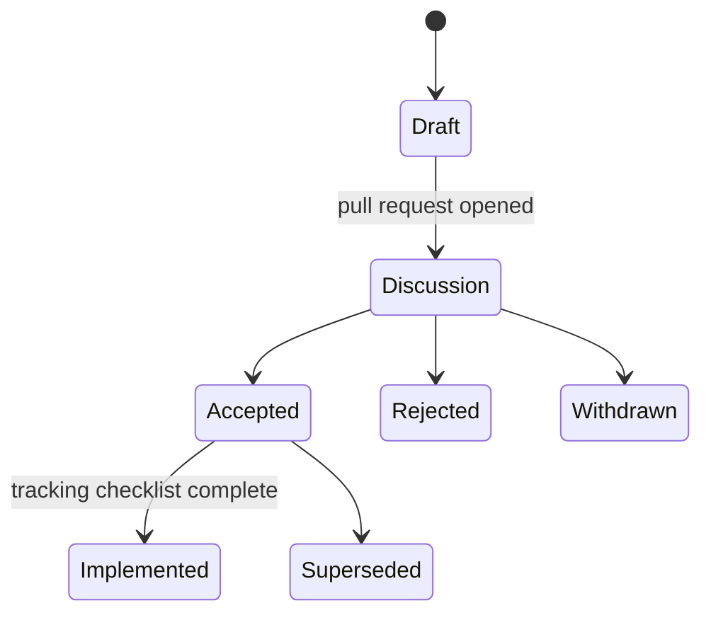

# Requests for comments

An RFC proposes a substantial change before it is built, so the design can be discussed while it is still cheap to change. ADRs then record the decisions an RFC leads to, and the [architecture docs](../architecture.md) describe what exists.

## When to write one

Write an RFC for:

- a new service, or replacing one
- changes to the application template's interface
- a new deployment target (Kubernetes, Terraform)
- cross-cutting behaviour (tenancy, secrets, networking, upgrades)
- a multi-PR plan that others need to follow

Bug fixes, refactors that keep behaviour, and documentation don't need one.

## Lifecycle

1. Copy [`template.md`](template.md) to the next number, for example `0002-short-title.md`, with status **Draft**.
2. Open a pull request titled `docs(rfc): RFC-0002 short title`. Discussion happens on the PR.
3. When consensus is reached, set the status to **Accepted** (or **Rejected** or **Withdrawn**, keeping the reasoning) and merge.
4. Implementation PRs reference the RFC and tick its tracking checklist. Decisions made along the way get ADRs.
5. When the checklist is complete, set the status to **Implemented**.

RFCs are living documents while Accepted: the tracking checklist and "unresolved questions" are updated as work lands. The design sections change only through a new RFC that supersedes it.

## Index

| RFC | Title | Status |
|---|---|---|
| [0001](0001-v0.1-implementation-plan.md) | v0.1 implementation plan | Implemented |
